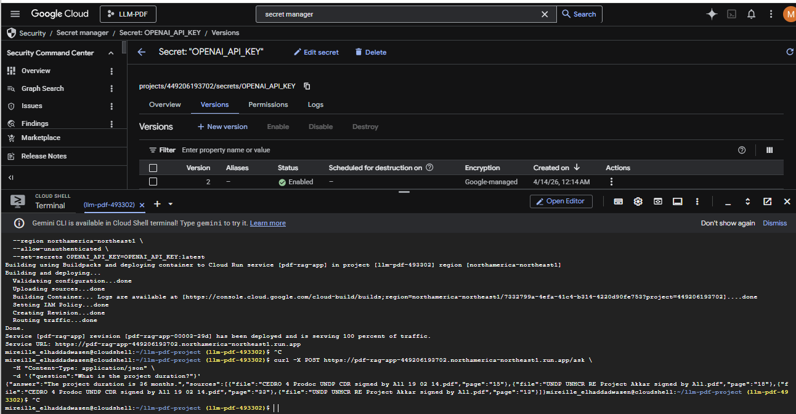

# 1. Create virtual environment
```
python -m venv .venv
```
Activate virtual enviroment
```
.\.venv\Scripts\Activate.ps1

```

Install needed packages for my project
```
python -m pip install --upgrade pip
python -m pip install langchain langchain-community langchain-openai faiss-cpu pypdf python-dotenv
```

Had to stop SSL
```
 PS C:\Users\mirei\OneDrive\Desktop\llm-pdf-project> Remove-Item Env:SSLKEYLOGFILE -ErrorAction SilentlyContinue
>> $env:SSLKEYLOGFILE = $null
```


Link to git repo:

```
git remote add origin git@github.com:mireillehaddad/LLM-PDF.git
```
# 2. Questions foe PDF's

Basic factual questions (should be EASY for mymodel)
- What is the title of the project?
- Which organization is leading the project?
- What is the total funding requested?
- What is the project duration?
- Which region does the project target?


to deploy into cloud:
```
& "C:\Users\mirei\AppData\Local\Google\Cloud SDK\google-cloud-sdk\bin\gcloud" auth login

& "C:\Users\mirei\AppData\Local\Google\Cloud SDK\google-cloud-sdk\bin\gcloud" config set project llm-pdf-493302

& "C:\Users\mirei\AppData\Local\Google\Cloud SDK\google-cloud-sdk\bin\gcloud" run deploy pdf-rag-app `
  --source . `
  --region northamerica-northeast1 `
  --allow-unauthenticated `
  --set-secrets OPENAI_API_KEY=OPENAI_API_KEY:latest
```


  

```

  mireille_elhaddadwazen@cloudshell:~/llm-pdf-project (llm-pdf-493302)$ gcloud run deploy pdf-rag-app \
  --source . \
  --region northamerica-northeast1 \
  --allow-unauthenticated \
  --set-secrets OPENAI_API_KEY=OPENAI_API_KEY:latest
Building using Buildpacks and deploying container to Cloud Run service [pdf-rag-app] in project [llm-pdf-493302] region [northamerica-northeast1]
Building and deploying...                                                                                                                                                                                  
  Validating configuration...done                                                                                                                                                                          
  Uploading sources...done                                                                                                                                                                                 
  Building Container... Logs are available at [https://console.cloud.google.com/cloud-build/builds;region=northamerica-northeast1/456c4f81-8ecb-4194-89bf-931e7cf83024?project=449206193702]....done       
  Setting IAM Policy...done                                                                                                                                                                                
  Creating Revision...done                                                                                                                                                                                 
  Routing traffic...done                                                                                                                                                                                   
Done.                                                                                                               ```


Service [pdf-rag-app] revision [pdf-rag-app-00003-29d] has been deployed and is serving 100 percent of traffic.
Service URL: https://pdf-rag-app-449206193702.northamerica-northeast1.run.app


GCP deployed:

```md


